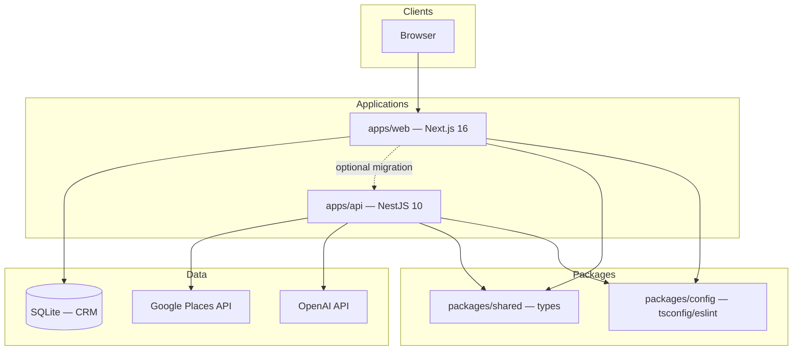

# Area To Monitor (AM2)

**Version: 0.2.0-beta**

Open-source, self-hosted B2B sales workspace: business discovery, mapped CRM, AI-assisted outreach, routes, calendar, and territories.

## Monorepo architecture



| Package | Port | Description |
|---------|------|-------------|
| `@am2/web` | 3000 | Next.js UI, NextAuth, SQLite CRM, API routes |
| `@am2/api` | 4000 | NestJS: Places proxy, search grid, geo, AI, leads stubs |

All Next.js code is in **`apps/web/src`**. See [docs/MIGRATION.md](docs/MIGRATION.md).

## Important limitation

**AM2 does not include real-time sync or a live shared business database.** Search uses Google Places (when configured), a bundled catalog, plus CSV import. CRM data lives in **SQLite on your server**.

## Quick start

```bash
cp .env.example .env
# Set AUTH_SECRET, AM2_INTERNAL_API_KEY, Google keys (see .env.example)

npm install
npm run dev:all      # Web @ :3000 + API @ :4000
```

Register at [http://localhost:3000](http://localhost:3000) → **Launch control plane**.

### Docker (web + API)

```bash
echo "AUTH_SECRET=$(openssl rand -base64 32)" > .env
docker compose up --build
```

- Web: [http://localhost:3000](http://localhost:3000)
- API health: [http://localhost:4000/health/live](http://localhost:4000/health/live)

### Environment

| Variable | App | Required | Description |
|----------|-----|----------|-------------|
| `AUTH_SECRET` | web | Yes | Session signing |
| `NEXTAUTH_URL` | web | Production | Public app URL |
| `GOOGLE_MAPS_API_KEY` | web, api | No | Live Places search |
| `OPENAI_API_KEY` | web, api | No | AI features |
| `DATABASE_PATH` | web | No | Default `./data/am2.db` |
| `PORT` | api | No | Default `4000` |
| `CORS_ORIGIN` | api | No | Default `http://localhost:3000` |
| `NEXT_PUBLIC_AM2_API_URL` | web | No | Nest API base URL (default `http://localhost:4000`) |
| `AM2_API_URL` | web | No | Server-side Nest URL for BFF proxies |
| `AM2_INTERNAL_API_KEY` | web + api | **Yes** (both stacks) | Shared secret — `openssl rand -hex 32` |
| `HUNTER_API_KEY` | api | No | Hunter.io email enrichment |
| `DATABASE_PATH` | web + api | No | Shared CRM SQLite (`apps/web/data/am2.db`) |

**Required:** set the same `AM2_INTERNAL_API_KEY` in repo-root `.env` (web loads it via `apps/web/.env` symlink). Run `npm run dev:all`.

See [docs/ROADMAP.md](docs/ROADMAP.md) for the full feature list.

## Scripts

| Command | Description |
|---------|-------------|
| `npm run dev` / `dev:web` | Next.js development |
| `npm run dev:api` | NestJS watch mode |
| `npm run build` | Build all workspaces (Turbo) |
| `npm run typecheck` | Typecheck all workspaces |
| `npm run lint` | ESLint (web) |

## API overview

**Web (Next.js):** authenticated JSON under `/api/*` — leads, search, territories, calendar, team, routes, assistant.

**Nest (`apps/api`):**

| Route | Module |
|-------|--------|
| `GET /health` | Health check |
| `GET /places/search` | Google Places proxy |
| `GET /search?mode=reaching` | Grid-paginated area search |
| `GET /geo/countries` | Country / province / city hierarchy |
| `POST /enrichment` | Enrichment pipeline stub |
| `POST /ai/*` | Summaries, smart sales, smart emails |
| `POST /reputation/:id/score` | Reputation scoring stub |
| `POST /leads/import` | Lead import (SQLite-compatible shape) |
| `POST /qualified-data/enrich` | Tiered business enrichment (Google + AI) |
| `GET /qualified-data/:placeId` | Cached enrichment profile |

## License

MIT — see [LICENSE](LICENSE).

## Repository

[github.com/Dev4YM/AM2](https://github.com/Dev4YM/AM2)
